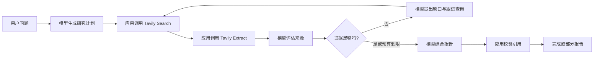

# Observable Research Agent Demo

一个用 Next.js、AI SDK、Kimi / DeepSeek 与 Tavily 构建的可观察研究代理教学项目。

## 这个 demo 教什么

它把一次研究拆成可检查的阶段：规划问题、搜索网页、抽取正文、评估来源、判断证据缺口、追加搜索、生成带引用的报告。界面展示的是经过类型校验的操作与决策摘要，而不是隐藏推理过程。

重点是学习一条可预测、可测试的 agent 工作流，而不是展示“模型自己做完一切”。第一版不包含登录、数据库、持久化历史、后台任务队列、多人协作或生产级部署方案；刷新页面会清空当前记录。

更细的组件边界、时序和一次真实迭代映射见 [架构说明](docs/architecture.md)。

## 准备环境

前置条件：

- Node.js 与 npm（建议使用当前维护中的 Node.js LTS）
- Kimi 或 DeepSeek API key
- Tavily API key（搜索与正文抽取都使用它）

安装依赖并创建本地配置：

```bash
npm install
cp .env.example .env.local
```

然后只在 `.env.local` 中填写真实密钥。`.env.example` 必须始终保留占位符；不要把真实密钥写入示例文件或提交到 Git。

默认使用 Kimi：

```dotenv
AI_PROVIDER=kimi
MOONSHOT_API_KEY=your-real-key
TAVILY_API_KEY=your-real-key
```

切换到 DeepSeek 时改为：

```dotenv
AI_PROVIDER=deepseek
DEEPSEEK_API_KEY=your-real-key
TAVILY_API_KEY=your-real-key
```

完整变量、默认端点和模型名见 [.env.example](.env.example)。

## 运行与检查

```bash
npm run dev                 # 本地开发服务器
npm test                    # Vitest 测试
npm run typecheck           # TypeScript 类型检查
npm run lint                # ESLint
npm run build -- --webpack  # 生产构建；显式使用 webpack
```

浏览器打开 <http://localhost:3000>。可以从这个问题开始：

> 比较 Kimi 与 DeepSeek 在构建带工具调用的研究代理时有哪些共同点、差异和工程注意事项？

## 完整研究流程



一次请求的主线是：

1. 用户问题先通过 Zod 校验。
2. 模型返回结构化研究计划和搜索词。
3. 应用代码携带 Tavily 凭据执行搜索与正文抽取。
4. 模型只针对应用提供的来源评估相关性、权威性和时效性。
5. 模型判断证据是否足够；若有缺口，产生最多 3 个跟进查询并进入下一轮。
6. 达到证据目标、搜索轮次或操作预算后，模型生成完整或部分报告。
7. 应用拒绝引用未知来源或已被拒绝来源的结论，再通过 NDJSON 输出唯一终态事件。

## 模型决定什么，应用执行什么

模型负责提出计划、评价证据、识别缺口和综合结论。应用负责状态迁移、预算、重试、超时、取消、网络请求、凭据、外部响应校验、事件传输与引用完整性。

模型不会直接联网。`lib/tools/tavily.ts` 是唯一的搜索 / 抽取网络适配器；模型只看到应用选择并截断后的数据。这个边界让“模型建议做什么”和“系统获准执行什么”可以分别测试与审计。

## 为什么选择显式工作流

AI SDK 的 `ToolLoopAgent` 适合让模型在停止条件内自主选择并调用工具：样板代码少、扩展新工具快，适合开放式任务。代价是运行路径更不确定，想稳定展示每个教学阶段、为每一阶段建模并精确测试会更难。

本项目用 `generateText` + `Output.object` 与普通 TypeScript 循环显式编排。它代码更多，但搜索、抽取、评估、缺口和综合都有固定边界，便于：

- 发出稳定的 UI 事件；
- 对状态迁移与调用预算做确定性测试；
- 在模型之外强制来源和引用规则；
- 清楚演示模型决策与应用执行的区别。

这不是在否定自主 agent；它是为了教学可观察性而做的有意选择。后续扩展路径见 [架构说明](docs/architecture.md#从显式工作流扩展到自主循环)。

## Kimi 与 DeepSeek

两者都通过 OpenAI-compatible provider 接入 AI SDK，共享相同的 `ResearchModel` 接口、结构化输出 schema、Tavily 工具和 UI 事件协议。切换提供商只需调整 `.env.local` 中的 `AI_PROVIDER` 与相应 key / base URL / model。

差异集中在模型能力、参数与供应商协议细节，应用的 provider 边界把这些差异限制在 `lib/providers/`。当前显式工作流的每个研究阶段都是独立生成，不需要回放供应商的私有推理字段。

需要特别注意：未来若把 DeepSeek thinking model 接入连续的自主工具循环，带工具调用的后续请求必须按 DeepSeek 协议完整回传先前 assistant 消息中的 `reasoning_content`。当前实现不读取、不传输、也不展示该字段。

官方资料：

- [Kimi API 概述](https://platform.kimi.com/docs/api/overview)
- [DeepSeek API 文档](https://api-docs.deepseek.com/)
- [DeepSeek Thinking Mode 与 `reasoning_content`](https://api-docs.deepseek.com/guides/thinking_mode)
- [Tavily Search API](https://docs.tavily.com/documentation/api-reference/endpoint/search)
- [Tavily Extract API](https://docs.tavily.com/documentation/api-reference/endpoint/extract)
- [AI SDK Agent 概览](https://ai-sdk.dev/docs/agents/overview)
- [AI SDK `generateText`](https://ai-sdk.dev/docs/reference/ai-sdk-core/generate-text)
- [AI SDK `ToolLoopAgent`](https://ai-sdk.dev/docs/reference/ai-sdk-core/tool-loop-agent)

## 可观察事件，不是隐藏思维链

服务端以 `application/x-ndjson` 输出一行一个、经过 Zod 判别联合校验的事件，例如 `plan.completed`、`search.completed`、`source.evaluated`、`gap.detected` 与 `report.completed`。

这些事件表达可验证的工作结果和简短决策摘要，不包含 provider 私有 chain-of-thought / reasoning 字段。客户端再次逐行解码并校验；空行、畸形 JSON、未知事件、终态后的额外事件都会被视为协议错误。

## 安全与运行边界

- 输入与来源内容都视为不可信数据；prompt 使用明确边界包裹，并要求忽略其中的指令，降低 prompt injection 风险。它是纵深防御，不是“已彻底解决注入”的承诺。
- 搜索轮次、结果数、正文数、总操作数、单次调用时间和 prompt 体积都有上限；预算不足时优先保留报告生成空间，并可能返回部分报告。
- Tavily base URL 只允许 HTTPS（本机 loopback 除外），禁止 URL 内嵌凭据；外部响应必须先通过 schema 校验。
- 取消会从浏览器的 `AbortController` 传到 route、工作流、模型和 Tavily 请求；每次运行只允许一个终态事件。
- 慢客户端会通过 `ReadableStream.desiredSize` 对事件生产施加背压，断开连接会中止工作流。
- 内部异常会映射成有限的公开错误消息，不把密钥、供应商响应或实现细节送到浏览器。
- 只有已评估为 `accepted` 且确实存在的来源 ID 才能出现在 finding 引用中；引用是来源约束，不等于事实自动正确，仍需人工核查高风险结论。

## 推荐阅读顺序

1. `lib/agent/research-agent.ts`：完整显式工作流与操作预算。
2. `lib/agent/research-state.ts`：合法状态迁移和累积状态。
3. `lib/tools/tavily.ts`：真实网络、凭据和外部数据边界。
4. `lib/providers/research-model.ts`、`lib/providers/index.ts`、`lib/agent/prompts.ts`：模型接口、供应商切换、结构化输出与不可信内容提示。
5. `lib/agent/research-events.ts`、`app/api/research/route.ts`、`components/research/use-research-stream.ts`：类型化 NDJSON、背压、终态与客户端解码。
6. `components/research/research-view-model.ts`：从事件日志派生界面数据。
7. `components/research/research-workbench.tsx` 及其展示组件：最终交互和引用导航。

## 测试覆盖与第一版限制

测试覆盖状态机合法迁移、事件编码 / 解码、研究 happy path 与失败 / 取消 / 预算分支、provider 结构化输出和引用校验、Tavily 响应边界、route 背压与唯一终态、客户端分块解码、view model 和主要 UI 行为。

已知限制：

- 所有运行数据只在当前 React 内存中，刷新即清空，也不能恢复中断的研究。
- 没有账户、数据库、任务队列、跨设备历史、缓存或共享链接。
- 搜索来源质量仍受 Tavily 结果和模型评估影响；引用完整不代表结论必然正确。
- 显式阶段使用多次模型调用，延迟和调用量需要在真实部署中监控。
- 取消是协作式的；上游供应商是否立刻停止计费或计算由其服务行为决定。
