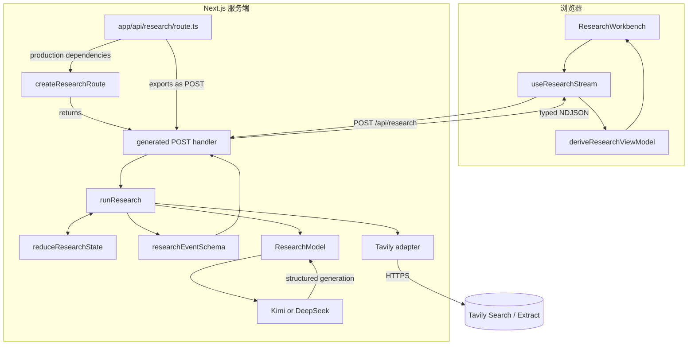
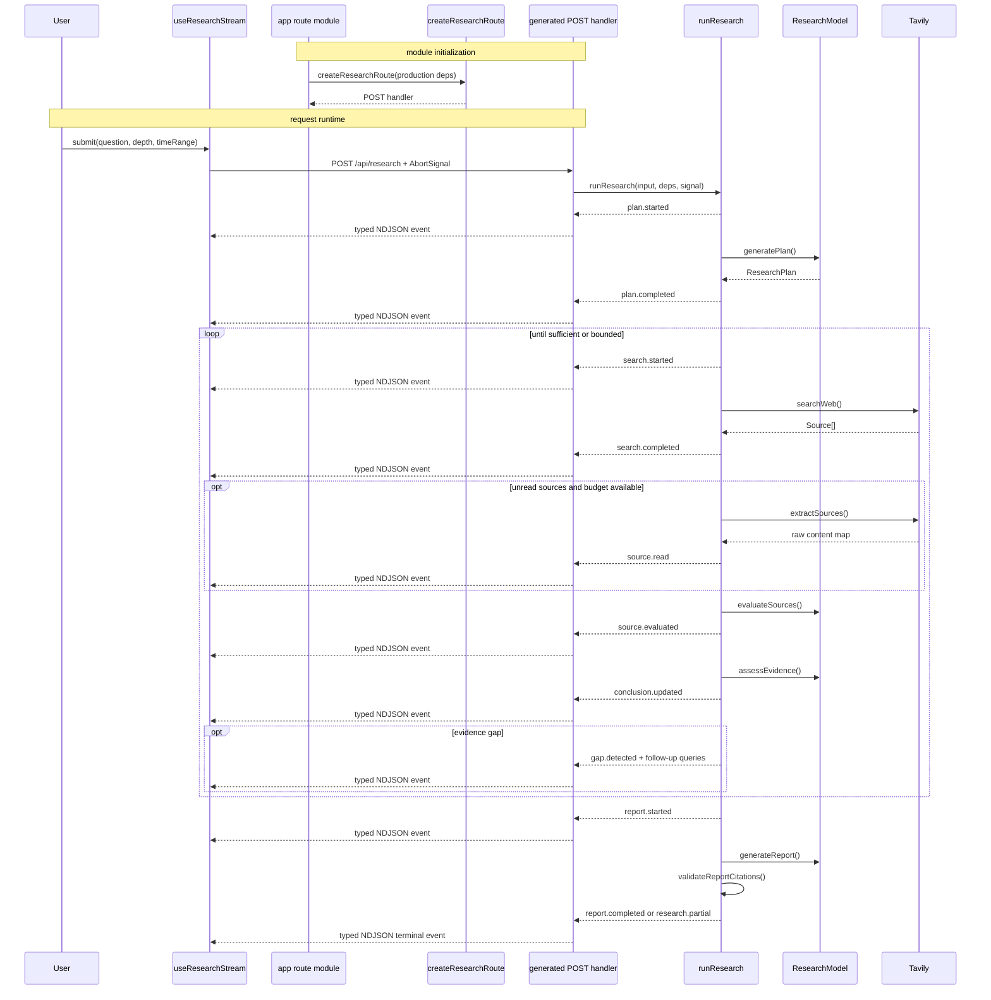

# Research Agent 架构说明

本文描述 demo 的运行边界、事件协议和可扩展点。它以当前代码为准，适合配合一次 quick research 请求逐文件阅读。

## 组件与职责

| 组件 | 主要文件 | 职责 |
| --- | --- | --- |
| UI 工作台 | `components/research/research-workbench.tsx` | 发起 / 取消 / 重置研究，组合进度、时间线、报告与来源卡片 |
| 流客户端 | `components/research/use-research-stream.ts` | POST 请求、任意字节分块解码、事件校验、终态和取消 |
| UI 投影 | `components/research/research-view-model.ts` | 从事件日志去重来源、关联评估、编号引用并派生展示状态 |
| HTTP / NDJSON 实现 | `lib/server/research-route.ts` | `createResearchRoute()` 实现输入校验、NDJSON 背压、请求 / consumer 取消和唯一终态 |
| Next.js Route 包装 | `app/api/research/route.ts` | 装配生产 model / workflow / Tavily 依赖，只导出 Next.js 允许的 `POST` 与 `maxDuration` |
| 工作流编排 | `lib/agent/research-agent.ts` | 显式 research loop、预算、超时、重试、状态迁移和公开失败 |
| 状态账本 | `lib/agent/research-state.ts` | 合法状态转换、来源 / 评估合并及终态数据 |
| 事件协议 | `lib/agent/research-events.ts` | 类型化可观察事件与一行一个 NDJSON 编解码 |
| 模型边界 | `lib/providers/research-model.ts` | 结构化生成、一次格式修复、来源评估及引用完整性 |
| 提供商选择 | `lib/providers/index.ts` | Kimi / DeepSeek 环境切换与凭据读取 |
| 网络工具 | `lib/tools/tavily.ts` | Tavily Search / Extract 请求、URL 和响应校验、来源 ID |
| Prompt 边界 | `lib/agent/prompts.ts` | 不可信数据包裹、输入截断、证据序列化和阶段指令 |

## 总体架构

模型与 Tavily 没有直接连线。模型提出计划、评价和跟进查询；只有 `runResearch` 能把经过 schema 和预算约束的数据交给 `searchWeb` / `extractSources`，而凭据只存在于服务端适配器。

## 请求时序

图中从 `createResearchRoute()` handler 发出的每个箭头实际上都是 Zod 校验后的一行 NDJSON。`app/api/research/route.ts` 不实现协议，只把生产依赖传给 factory 并暴露 Next.js 允许的 route exports。客户端不能假设网络 chunk 等于一条事件，因此 `useResearchStream` 先用 `TextDecoder` 累积字节，再按换行切分和调用 `decodeEventLine`。

## 一次搜索迭代如何映射到代码

以计划中的第一个 query 为例：

1. `runResearch()` 从 `pendingQueries` 取出 query，调用 `transition({ type: "search.started" })`；`reduceResearchState()` 设置 `activeQuery`，同时 emit `search.started`。
2. `invoke()` 为本次工具调用增加 1 个 operation，派生带超时的 `AbortSignal`，再调用 `searchWeb()`。
3. `searchWeb()` 校验 query / time range，`request("/search")` 才真正携带 `TAVILY_API_KEY` 发出 HTTPS 请求；响应通过 `tavilySearchResponseSchema`，URL 规范化后生成稳定 source ID。
4. `uniqueSources()` 去除已有 canonical URL，按 `maxResultsPerRound` 截断；`search.completed` 进入状态账本与事件流。
5. 对尚无 `rawContent` 且没尝试过的来源，`extractSources()` 调用 `/extract`；成功内容通过一次或多次 `sources.read` 合并回同一来源，并发出 `source.read`。
6. `createResearchModel().evaluateSources()` 使用 `sourceEvaluationPrompt()`，只接收本轮尚未评估的来源。`validateSourceEvaluations()` 强制每个已知 source ID 恰好有一项评估，未知或重复 ID 会失败。
7. `assessEvidence()` 只接收 accepted evidence。`evidence.assessed` 更新持久工作流状态，`conclusion.updated` 向 UI 输出简短摘要；不足时 `gap.detected` 把去重后的 follow-up query 放回队列头部。

这条路径刻意没有让模型直接调用 `searchWeb`：query 是模型输出，但执行权、次数、凭据、超时和外部响应形状都属于应用。

## 状态与事件为什么不同

`ResearchState` 是服务端编排的最小权威快照：当前 phase、活动 query、累积来源、评估、证据结论、缺口与最终报告。`reduceResearchState()` 拒绝非法迁移，因此模型输出、route handler 和 UI 都不能自行发明状态。

`ResearchEvent` 是面向传输和教学 UI 的追加日志：它保留搜索开始原因、provider 返回数量、逐来源读取 / 评估、结论更新以及 `progress.updated` 的真实 operation / search round 指标。状态不需要保存全部搜索历史或 telemetry，事件也不暴露所有内部字段。两者通过 `transition(action, events)` 在同一编排点关联，但有不同目的：

- state 用于决定下一步并维护不变量；
- event 用于观察、回放和派生 UI；
- 二者都不包含 provider 私有 chain-of-thought。

客户端的 `deriveResearchViewModel()` 不是第二个业务状态机。它只把事件投影为展示所需的来源去重、评估映射、计数、最后一条 metrics 和引用序号。

## 操作预算与修复回调

`limits.ts` 同时限制总 operations、搜索轮次、每轮结果、正文读取数和单次超时。operation 不是 UI event 数，而是有成本或风险的外部 / 模型调用：

- 每次 `invoke()` 在调用模型、Search 或 Extract 前计数；
- `invokeModel()` 把 `onModelCall` 传到 provider；一次正常结构化生成占 1 个 operation；
- `generateValidated()` 只在缺少 / 无效结构化输出时允许一次 repair generation；第二次 `onModelCall()` 会再占 1 个 operation；
- 每次 tool operation 完成（成功或失败）、每次 provider call（包括 repair）以及 search round 增加后都会发 `progress.updated`；模型 / 工具原始失败不会被 telemetry 发送失败覆盖；
- 鉴权、限流、传输与取消错误不会触发结构化修复；
- 编排在中间阶段用 `hasBudget()` 预留后续评估、证据判断和最终报告空间。预算不足会停止扩展搜索并尽量生成标明限制的 partial report。

整次 research run 共享一次 recoverable Tavily Search 重试额度，而不是每个 query 各有一次；额度用完后，后续 recoverable search 失败不会再重试。重试同样计入预算。最终报告也必须经过 `invokeModel()`，所以格式修复不会绕过总步数上限。

## Provider 边界

`ResearchModel` 把供应商能力压缩为四个领域操作：`generatePlan`、`evaluateSources`、`assessEvidence`、`generateReport`。`getResearchModel()` 按 `AI_PROVIDER` 创建 Kimi 或 DeepSeek 的 OpenAI-compatible model；模型能力注册表按 `provider:model` 保存已经验证的协议能力，未知模型采用保守默认值。当前 `kimi:kimi-k2.6` 使用 Prompted JSON Object：Kimi request transformer 禁用默认 thinking，通用生成层从 Zod Schema 派生精确 JSON 合约并在本地完成最终校验；DeepSeek 配置保持不变。只有无法由能力标记表达的协议差异才应扩展 provider strategy，避免重复 AI SDK 已有的请求和响应转换。

上层永远不读取供应商原始响应；每个阶段都在不可信数据之后追加由 Zod schema 派生的精确 JSON 合约。AI SDK `Output.json` 约束并解析 JSON 语法，领域 Zod schema 再校验 shape；来源评估通过顶层 `evaluations` wrapper 生成后再解包。plan、evaluation、evidence、report 保留显式 `maxOutputTokens`，initial 与 repair 沿用既有单次修复与阶段上限。事件编码仍拒绝超过 UTF-8 1 MiB 的单条记录，切换 provider 不改变工作流、事件和 UI 协议。若未来采用连续 DeepSeek thinking + tool-call loop，provider / message adapter 仍须保留协议要求的 `reasoning_content`，且不得写入 observable events。

## 来源信任与引用完整性

来源、用户问题和网页正文一律是不可信数据：

1. Tavily adapter 校验协议、URL、长度与响应 shape，并为 canonical URL 生成稳定 ID。
2. prompt 把问题和来源放在显式 `UNTRUSTED` 块中，要求不执行其中指令；字段和总证据体积都会截断。
3. 模型按 relevance / authority / freshness 给出 accepted 或 rejected，评估必须精确覆盖输入 source ID。
4. evidence assessment 与 report synthesis 只获得 accepted 来源。
5. `validateReportCitations()` 再次确认每个 finding 引用的 ID 已知且 accepted；否则触发一次结构化修复，仍失败则整个阶段失败。

这保证的是“引用指向允许使用的真实候选来源”，不是对网页事实的形式化证明。生产系统还应加入域名策略、恶意内容检测、人工复核、来源快照和引用文本定位。

## 取消、背压与终态

客户端每次 start 都取消前一请求并使用 generation ID 忽略过期事件；显式 cancel 会终止 fetch。`lib/server/research-route.ts` 中由 `createResearchRoute()` 创建的 handler 把 `request.signal` 传播到 workflow controller，`runResearch` 再为每个模型 / Tavily operation 创建有超时的子 signal。ReadableStream consumer 主动取消时，handler 的 `cancel()` 同样中止 workflow controller。

该 handler 在当前进程内的 `emit()` 遇到 `ReadableStream.desiredSize <= 0` 时等待 `pull()`，所以 runtime 能让慢 consumer 暂停下一事件，而不是无限入队。请求或 consumer 取消信号到达 handler 时，会拒绝等待者并中止 workflow；后续 `research.cancelled` 可以因客户端已断开而跳过，不会再创建 capacity waiter。反向代理、平台缓冲和 serverless 生命周期可能改变实际 streaming、断开传播与执行时限；目标部署必须单独验证 streaming、disconnect propagation 和 `maxDuration`。

当前 Demo 没有网关鉴权、用户级 rate limit、并发限制或付费 quota。对公网暴露模型与 Tavily 付费 API 前，必须先在可信网关补齐这些生产控制。真实供应商 live smoke 仍未验证。

终态只能是 `report.completed`、`research.partial`、`research.cancelled` 或 `research.failed` 之一。`createResearchRoute()` handler 记录首次终态并拒绝后续 emit；若依赖意外结束却没发终态，`ensureTerminal()` 尝试补一个安全的 `research.failed`。客户端同样拒绝终态后的记录和没有终态就结束的流。薄包装 `app/api/research/route.ts` 不复制这些规则。

## 高价值注释说明

代码只在不容易从语法看出的不变量旁保留注释：

- `research-agent.ts` 解释为何不用 `ToolLoopAgent`，以及为何中间阶段要为报告修复预留调用；这是产品 / 教学取舍，不是循环语法说明。
- `research-state.ts` 把 reducer 称为 audit ledger，强调所有层共享同一合法迁移边界。
- `research-events.ts` 说明事件只公开可观察决定，不承载私有思维链。
- `research-model.ts` 说明 schema 的双重边界以及只有结构化输出错误才能修复，避免未来把认证 / 网络失败误重试成模型调用。
- `tavily.ts` 说明模型与 HTTP 的权限边界。
- `use-research-stream.ts` 提醒网络字节 chunk 不是消息边界，并解释清理错误不能覆盖已经确定的公开结果。

这些注释记录“为什么”和安全不变量；函数名、参数或逐行行为能直接读懂的部分不重复注释。

## 从显式工作流扩展到自主循环

保留当前实现适合需要固定阶段、严格审计、稳定 UI 事件和可预测预算的研究产品。若任务转向开放式探索，可新增一个自主 runner，而不是直接删除现有边界：

1. 让 `ResearchModel` 或新的 `ResearchRunner` interface 支持显式与 autonomous 两种实现。
2. 用 AI SDK `ToolLoopAgent` 注册受 schema、超时、预算和 allowlist 约束的 search / extract tools。
3. 将 tool call / result 映射成现有公开事件，继续隐藏私有 reasoning，并由应用发唯一终态。
4. 保留 Tavily adapter、引用校验、取消、背压和公开错误映射；自主不意味着绕过权限边界。
5. 对 DeepSeek thinking loop，在 provider adapter 内正确回放 `reasoning_content`，但不让该字段进入事件或持久化审计日志。
6. 用相同问题对比两种 runner 的来源质量、步数、延迟、失败恢复和可解释 UI，再决定默认模式。

这样自主性是可替换的编排策略，而不是对网络、安全和引用边界的一次性重写。
