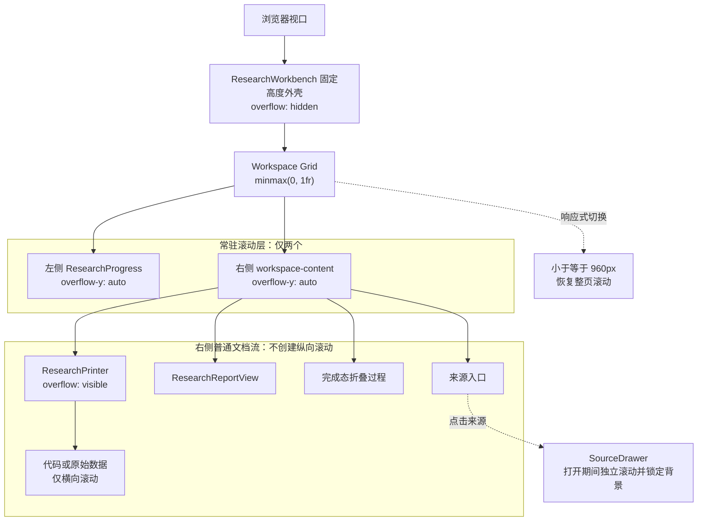
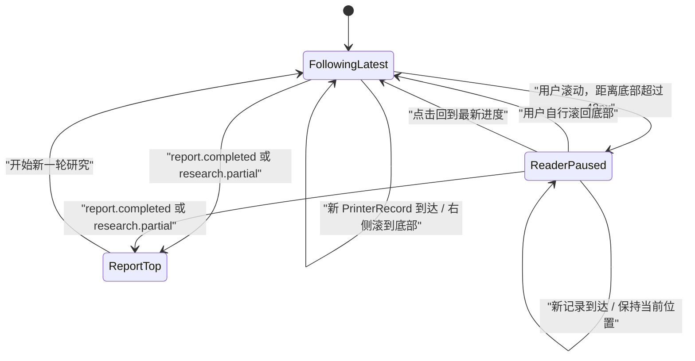

# 研究工作台滚动边界简化设计

## 1. 背景与目标

研究工作台为了实现桌面端独立滚动，已经把左侧进度面板和右侧内容区限制在固定视口内。但右侧的结构化打印流仍然拥有自己的 `max-height` 与 `overflow-y: auto`，导致用户在同一页面中遇到多层纵向滚动：滚轮先被打印流消费，到达边界后才转交右侧工作区，产生类似卡顿、失焦和“不知道正在滚动哪一层”的迷惑感。

本次改造采用已确认的“左右双滚动”方案：桌面常态只保留左、右两列两个纵向滚动容器，右侧内部的研究过程、报告和来源内容全部进入同一个文档流。来源抽屉只在打开期间作为临时模态滚动区存在。

成功标准：

- 桌面常态只有左侧进度栏和右侧工作区可以纵向滚动；
- 指针位于研究过程、报告或来源内容上时，滚轮始终驱动右侧工作区；
- 新事件仍可自动跟随，但用户向上阅读后不会被强制拉回底部；
- 完成态报告出现时，右侧定位到报告顶部；
- 手机端继续使用浏览器的整页滚动；
- 来源抽屉打开时锁定背景，仅抽屉自身滚动。

## 2. 已确认的产品决策

- 采用左右双滚动，不改为整页滚动，也不把左栏压缩成无滚动摘要。
- 左侧 `ResearchProgress` 保留完整阶段、计数、目标和问题列表，并独立滚动。
- 右侧 `.workspace-content` 是运行态、失败态和完成态唯一的常驻纵向滚动所有者。
- `.printer-viewport` 保留语义分组和可访问名称，但取消固定高度、纵向溢出和内部滚动状态。
- “回到最新进度”属于右侧工作区，不再属于打印流内部视口。
- 代码块允许横向滚动；纵向内容自然撑开，不再通过固定高度创建第二个纵向阅读区。
- 来源抽屉属于临时模态界面，可以独立纵向滚动；关闭后恢复背景滚动位置和触发元素焦点。
- 不修改服务端 Agent、NDJSON 事件协议、来源评估或报告数据结构。

## 3. 方案边界

### 3.1 采用方案：左右双滚动

左栏与右栏都被同一网格行限制在剩余视口高度中，各自处理自己的长内容。右侧所有常态内容直接铺开，不再嵌套任何纵向滚动视口。

### 3.2 未采用方案

- **单一右侧主滚动**：需要折叠或裁剪左侧完整计划，不符合保留完整进度信息的选择。
- **整页滚动**：滚动最简单，但会失去桌面工作台固定头部和左右信息并行阅读的优势。

## 4. 滚动所有权架构

滚动所有权遵循一个约束：常态页面中的任意可见点，向上查找最多只能遇到一个可纵向滚动祖先。左侧内容只遇到 `ResearchProgress`，右侧内容只遇到 `.workspace-content`。

## 5. 自动跟随数据流

现有 `ResearchPrinter` 同时承担记录渲染和内部滚动控制。取消打印流滚动后，滚动状态必须上移到真正拥有滚动条的右侧工作区。

### 5.1 运行态

`ResearchWorkbench` 持有 `.workspace-content` 的 ref，并监听该容器的滚动位置。追加打印记录时：

1. 若距离底部不超过 48px，则在布局完成后把右侧滚到底部；
2. 若用户已经离开底部，则保持当前位置，并显示固定在右侧工作区底部的“回到最新进度”；
3. 点击按钮后恢复跟随并滚到底部；
4. 自动滚动只改变展示位置，不能驱动研究状态、事件消费或报告生成。

### 5.2 完成态

当 `report.completed` 或 `research.partial` 首次让报告成为主内容时，右侧滚动到顶部，使标题和摘要进入视野。该行为优先于运行态的“跟随底部”，且每次状态转换只执行一次，避免后续来源状态更新反复抢夺阅读位置。

### 5.3 失败与取消态

失败和取消继续保留展开的研究过程。若用户仍在底部，终止记录跟随出现；若用户正在上方阅读，则保持当前位置并提供“回到最新进度”。

## 6. 组件职责调整

| 文件 | 调整后的职责 |
| --- | --- |
| `components/research/research-workbench.tsx` | 持有右侧滚动 ref、跟随状态和完成态定位；组合进度、打印流、报告与抽屉 |
| `components/research/research-printer.tsx` | 只渲染结构化记录、详情和来源入口；不再读取或修改滚动位置 |
| `components/research/research-printer.test.tsx` | 覆盖打印记录语义、最新记录动画标记和来源入口；删除内部滚动测试 |
| `components/research/research-workbench.test.tsx` | 覆盖右侧跟随暂停、恢复、追加记录和报告置顶 |
| `app/globals.css` | 保留左右两列滚动，移除打印流与代码块的内层纵向滚动规则 |
| `components/research/source-drawer.tsx` | 继续负责临时模态滚动、背景锁定和焦点恢复 |

为了便于学习，代码中的中文注释应解释“滚动所有权为何上移”“为什么完成态需要单独置顶”和“为什么展示滚动不能控制业务状态”，不为普通 ref、事件绑定或样式声明逐行注释。

## 7. CSS 与响应式规则

### 7.1 桌面端

- `.workspace-shell`：`height: 100dvh` 与 `overflow: hidden`；
- `.workspace-grid`：`grid-template-rows: minmax(0, 1fr)` 与 `min-height: 0`；
- `.progress-panel`、`.workspace-content`：分别使用 `overflow-y: auto`；
- `.printer-viewport`：`max-height: none`、`overflow-y: visible`，不设置 `overscroll-behavior` 或内部平滑滚动；
- `.event-card pre`：取消纵向 `max-height`，使用 `overflow-x: auto` 和 `overflow-y: visible`；
- “回到最新进度”相对右侧工作区固定展示，但不能覆盖报告正文或阻止键盘访问。

### 7.2 移动端

在 `max-width: 960px` 下，外壳、左栏和右栏恢复自动高度与可见溢出，由浏览器页面承担唯一纵向滚动。打印流继续作为普通文档内容，不额外覆盖移动端规则。

### 7.3 来源抽屉

抽屉打开时继续锁定 `body` 背景滚动，仅 `.source-drawer` 使用 `overflow-y: auto`。抽屉关闭后必须恢复打开前的背景样式和触发元素焦点。

## 8. 可访问性与动画

- `.printer-viewport` 继续使用 `role="region"` 与 `aria-label="Research process"`，取消滚动不会改变其语义价值；
- “回到最新进度”使用原生按钮，并拥有明确的可访问名称；
- 现有单一 `role="status"` 继续播报最新事件，不能把整个右侧工作区改为高频 `aria-live`；
- 打印走纸动画仍只作用于最新记录，不能依赖滚动容器触发；
- `prefers-reduced-motion: reduce` 下禁用平滑滚动和非必要动画；
- 键盘焦点进入右侧内容时，不应被自动跟随逻辑强制移动。

## 9. 异常与边界处理

- 浏览器不支持 `scrollTo` 时，研究流程仍正常工作，只失去自动定位；
- 右侧内容短于容器时不显示回到最新按钮；
- 用户展开 `
` 导致内容高度增加时，按实际滚动位置重新判断是否仍在底部；
- 来源抽屉打开期间暂停背景交互；关闭后不主动改变右侧滚动位置；
- 滚动处理使用接近底部阈值，避免小数像素和动画高度变化造成状态反复切换；
- 本次不引入全局滚动 store、虚拟列表、第三方滚动库或滚动位置持久化。

## 10. 测试与验证策略

实施遵循 RED → GREEN → REFACTOR：

1. **CSS 契约测试**
   - 左、右两列仍分别拥有纵向滚动；
   - `.printer-viewport` 不再拥有 `max-height` 或纵向 `overflow: auto`；
   - 代码块不再创建纵向滚动区。
2. **工作台交互测试**
   - 位于底部时追加记录会滚到最新位置；
   - 离开底部后追加记录不改变 `scrollTop`；
   - 点击“回到最新进度”恢复跟随；
   - 报告首次出现时滚动到右侧顶部。
3. **打印流测试**
   - 保留记录展示、来源点击与最新记录动画标记；
   - 删除只适用于内部打印视口的暂停/恢复测试。
4. **浏览器验证**
   - 桌面端检查左、右两列的 `clientHeight`、`scrollHeight` 与 `scrollTop`；
   - 确认 `.printer-viewport` 的 `scrollHeight === clientHeight` 或 `overflow-y: visible`；
   - 在打印卡片、报告段落和来源入口上滚轮时，只有 `.workspace-content.scrollTop` 改变；
   - 移动端确认恢复整页滚动；
   - 抽屉打开时确认背景不滚动、抽屉可以滚动。
5. **项目级验证**
   - `npm test`；
   - `npm run lint`；
   - `npm run typecheck`；
   - `npm run build`。

## 11. 非目标

- 不改变打印记录的领域聚合规则；
- 不增加 assistant-ui 或其他聊天线程组件；
- 不把打印效果改成逐字符流；
- 不持久化滚动位置或研究历史；
- 不实现虚拟列表；
- 不修改来源抽屉的信息结构；
- 不调整 Agent 搜索、评估和报告生成逻辑。

## 12. 与既有设计的关系

本文档是 `2026-07-15-structured-research-printer-design.md` 的滚动边界补充，并覆盖其中以下既有决策：

- `ResearchPrinter` 不再拥有独立滚动视口和自动跟随状态；
- “回到最新进度”由 `ResearchWorkbench` 的右侧滚动容器负责；
- 打印动画保持，但其生命周期与滚动容器解耦；
- 桌面端“独立滚动”明确指左列与右列，而不是右列内部的每个功能区。
