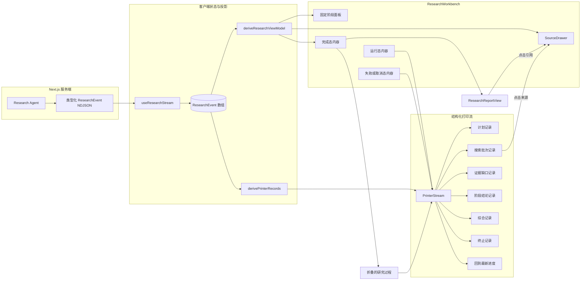
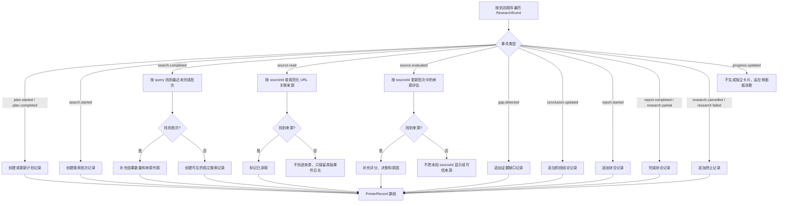
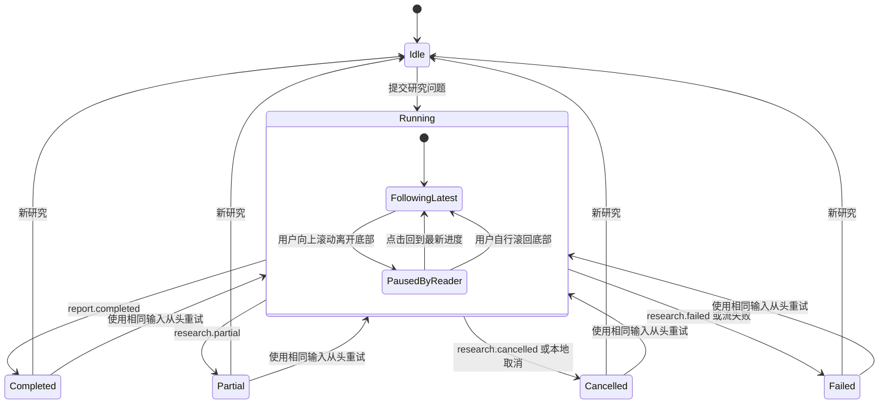
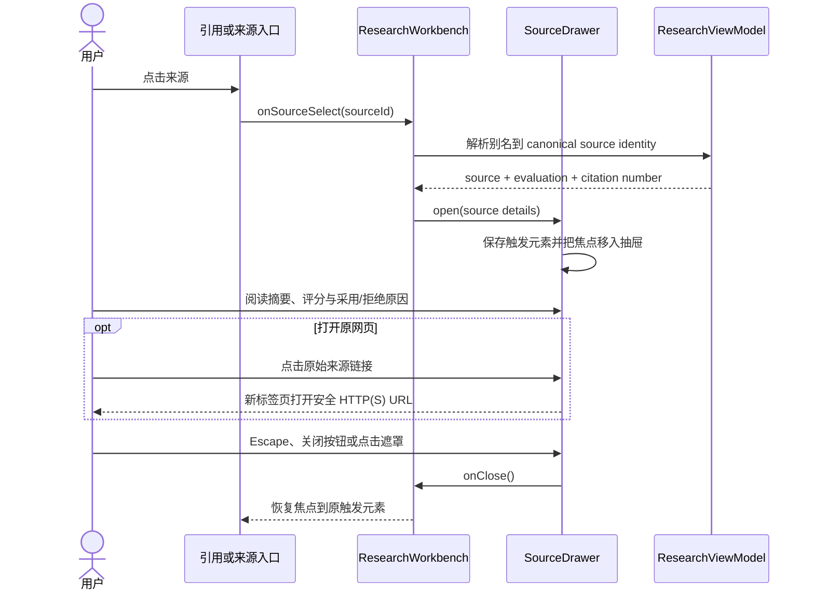
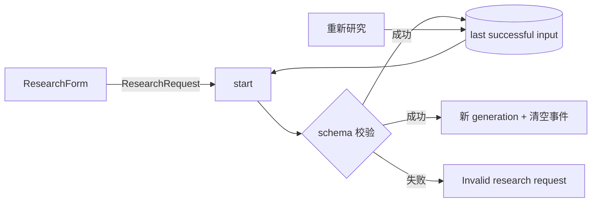

# 结构化研究打印流设计

## 1. 背景与目标

当前研究工作台已经通过类型化 NDJSON 持续接收 `ResearchEvent[]`，并把每个事件渲染为独立时间线卡片。它能够展示研究过程，但存在三个体验问题：

1. 搜索、来源读取和来源评估被拆成大量平级卡片，事件之间的业务关系不够清晰；
2. 运行完成后，用户必须先穿过完整时间线才能阅读最终报告；
3. 来源卡片占据报告下方的大块空间，点击引用会让用户离开当前阅读位置。

本次改造将右侧时间线升级为“结构化事件打印流”：事件按到达顺序逐块出现，但按研究语义聚合为紧凑记录。运行完成后，最终报告自动成为主内容，过程折叠，来源通过侧边抽屉查看。

这是一个学习型 Agent Demo。实现需要用中文注释解释不容易从语法直接看出的设计原因、状态不变量和交互边界，但不为普通 JSX、样式属性或简单数据搬运添加逐行注释。

## 2. 已确认的产品决策

- 不使用 assistant-ui 作为主渲染层。现有数据是领域事件流，不是消息线程；强行映射为 assistant-ui 消息会增加状态适配层，却不能简化核心展示逻辑。
- 左侧 `ResearchProgress` 继续固定展示阶段、计数与研究计划。
- 右侧在运行时展示结构化事件打印流，一条业务记录对应一张紧凑卡片。
- 一次搜索及其返回来源、读取状态和评估结果聚合为一张搜索批次卡片。
- 新业务记录以轻量展开和淡入动画出现；`prefers-reduced-motion` 下关闭非必要动画。
- 打印流默认跟随最新记录。用户主动向上滚动后暂停自动跟随，并显示“回到最新进度”。
- 研究完成或产生部分报告后，最终报告成为主内容，研究过程自动折叠。
- 研究失败或被取消时，保留并展开已有打印记录，明确显示终止原因。
- 重试复用相同输入，从头创建一轮新研究；本次不增加多轮历史记录或持久化。
- 点击报告引用、搜索批次中的来源或其他来源入口时，从右侧打开来源详情抽屉；关闭抽屉后恢复原阅读位置。
- 不展示供应商私有 chain-of-thought。界面只显示协议中已经公开的计划、行动原因、来源判断、证据缺口和阶段结论。

## 3. 方案比较

### 方案 A：assistant-ui 消息线程

把每个 `ResearchEvent` 映射为 assistant-ui message part，再通过 Thread 和自定义 Tool UI 展示。

优点是可以直接获得聊天线程、消息操作和流式文本基础能力。缺点是当前产品没有真正的多轮消息模型，搜索批次聚合、完成态重排、进度面板和来源抽屉仍需自行实现，还会引入运行时与消息格式转换。

### 方案 B：保留事件时间线，只增加动画

继续一事件一卡片，仅增加进入动画和自动滚动。

改动最小，但不能解决搜索事件碎片化、完成后报告层级不清晰、来源区域过长等主要问题。

### 方案 C：领域事件投影为结构化打印记录（采用）

保留 `ResearchEvent[]` 作为唯一客户端事实来源，增加纯函数投影，将底层事件聚合为少量 `PrinterRecord[]`。渲染层只理解计划、搜索批次、证据缺口、阶段结论、综合和终止等公开记录类型。

该方案与现有架构一致，能独立测试聚合规则，也为未来增加其他事件保留清晰边界，因此作为本次实现方案。

## 4. 总体架构

### 4.1 文件职责

| 文件 | 职责 |
| --- | --- |
| `components/research/research-printer-model.ts` | 把追加事件日志纯函数投影为有业务语义的打印记录；负责搜索批次关联，不包含 React 状态 |
| `components/research/research-printer.tsx` | 渲染打印记录、记录进入动画、展开详情与“回到最新进度”交互 |
| `components/research/source-drawer.tsx` | 渲染模态侧边抽屉、焦点管理、Escape/遮罩关闭与来源详情 |
| `components/research/research-workbench.tsx` | 根据运行状态组合左侧进度、运行态打印流、完成态报告和来源抽屉 |
| `components/research/research-view-model.ts` | 继续派生来源、评估、报告、引用序号和阶段；不承担打印记录聚合 |
| `components/research/research-workbench.test.tsx` | 覆盖工作台状态切换、抽屉入口、失败/取消保留和重试 |
| `components/research/research-printer-model.test.ts` | 覆盖聚合规则、顺序、不匹配来源与安全字段边界 |
| `components/research/research-printer.test.tsx` | 覆盖打印记录展示、详情折叠、自动跟随暂停与恢复 |
| `app/globals.css` | 打印记录、独立滚动、进入动画、折叠过程和侧边抽屉样式 |
| `docs/architecture.md` | 补充 UI 投影与打印流的学习路径 |

## 5. 事件聚合模型

`derivePrinterRecords(events)` 是无副作用纯函数。每次事件数组变化时重新投影；当前事件上限较小，优先保证规则清晰和可回放，不引入增量缓存或额外 store。

### 5.1 建议的打印记录联合类型

打印记录使用带 `kind` 的判别联合，至少包含：

- `plan`：问题、目标、子问题和计划查询；
- `search`：query、原因、运行状态、返回数、保留来源及其读取/评估状态；
- `gap`：证据缺口和跟进查询；
- `conclusion`：阶段性结论；
- `synthesis`：报告生成状态，以及是否为部分报告；
- `terminal`：取消或失败状态、公开错误和可重试性。

记录 ID 必须从事件顺序和稳定业务键构造，不能在 render 时使用随机数。这样 React 能正确识别新记录，进入动画也只作用于真正追加的记录。

### 5.2 搜索批次关联规则

1. `search.started` 总是创建一个新批次，允许同一 query 在不同轮次再次出现；
2. `search.completed` 从后向前匹配同 query 且尚未完成的批次；
3. 批次保存本轮 `sources`，来源顺序与协议顺序一致；
4. `source.read` 和 `source.evaluated` 按 `sourceId` 关联最近包含该来源的批次；
5. 重复 canonical URL 的引用编号继续由 `deriveResearchViewModel` 统一处理，打印模型不创建第二套引用编号规则；
6. 未知来源事件不生成看似可信的来源卡，但原始 `ResearchEvent[]` 仍然保留，便于诊断协议问题。

## 6. 页面状态与布局切换

### 6.1 运行态

- 左侧进度面板保持 `position: sticky`；右侧打印视口独立滚动。
- 最新记录追加后，仅在“跟随最新”状态滚动到底部。
- 距离底部超过一个小阈值时视为用户主动离开底部，暂停跟随。
- “回到最新进度”按钮必须可通过键盘操作，并使用明确的可访问名称。
- 打印区域本身不设置高频 `aria-live`。现有单一 `role="status"` 继续播报最新事件，避免屏幕阅读器重复朗读整张卡片。

### 6.2 完成态与部分完成态

- `report.completed` 和 `research.partial` 都将报告置于右侧最上方；部分报告保留明显的限制说明。
- 研究过程使用原生 `
` 折叠，默认关闭；用户可以展开回看全部打印记录。
- 来源不再在报告后方铺开为网格，统一通过抽屉进入。

### 6.3 失败与取消态

- 不折叠打印过程；保留最后已知事件和搜索批次状态。
- 顶部错误/取消提示说明公开原因，不从异常对象或 provider 响应泄漏内部信息。
- 提供“重新研究”动作，使用上一次已校验的请求调用 `start(previousInput)`，从头替换当前运行。
- “新研究”仍回到空白表单。无多运行列表、历史恢复或页面刷新持久化。

## 7. 来源抽屉

抽屉要求：

- 使用模态语义（`role="dialog"`、`aria-modal="true"`、可访问标题）；
- 打开时锁定背景滚动，关闭时恢复；
- 初始焦点进入关闭按钮，关闭后回到触发元素；
- 支持 Escape 和遮罩关闭；
- 桌面端从右侧滑入，移动端可占据大部分视口宽度；
- 展示引用序号、标题、域名、发布日期、摘要、来源评分、采用/拒绝原因和原链接；
- 不默认展示 `rawContent`，避免把长网页正文变成第二个阅读器。

## 8. 动画和视觉规则

- 新打印记录使用 `opacity` 与小幅 `translateY`/网格高度变化，动画时间控制在约 160–220ms；不模拟逐字符打字。
- 搜索批次内部状态更新不重新播放整卡进入动画，仅更新状态标记。
- 活跃记录可显示低干扰的运行指示器，但不能依赖颜色传达状态。
- 卡片正文默认保持一到三行摘要；计划问题、搜索来源和原始事件等详情通过 `
` 展开。
- `prefers-reduced-motion: reduce` 时取消滑动、平滑滚动和闪烁效果。
- 打印流和来源抽屉使用现有纸张、墨色、teal/blue 状态色，避免引入一套 assistant-ui 视觉语言。

## 9. 重试输入边界

为了支持“相同问题从头重试”，`useResearchStream` 或 `ResearchWorkbench` 需要保留最近一次通过 `researchInputSchema` 校验的 `ResearchRequest`。只保存在当前页面内存中：

重试不复用旧 `AbortController`、generation ID、事件数组、来源评估或进度计数。旧运行只在用户点击重试前保持可见。

## 10. 错误处理与安全边界

- 继续使用 `researchEventSchema` 与 `decodeEventLine` 作为协议边界；打印模型不解析未知对象。
- 原始事件调试内容继续过滤 `reasoning`、`chain-of-thought` 和 `rawContent` 等私有或过长字段。
- 未知来源 ID 不进入来源抽屉，也不生成可信引用。
- 抽屉外链继续限制为已经收集并通过现有 URL schema 的 HTTP(S) 来源。
- 自动滚动、动画或焦点恢复失败不能影响研究状态与终态。
- 本次不修改服务端 Agent、provider、Tavily 或 NDJSON 协议。

## 11. 测试策略

实施遵循 RED → GREEN → REFACTOR：

1. **打印投影单元测试**
   - 计划开始/完成合并为一条记录；
   - 一次搜索的 started/completed/source.read/source.evaluated 聚合为一个批次；
   - 相同 query 的多轮搜索保持为不同批次；
   - gap、conclusion、synthesis、terminal 顺序稳定；
   - `progress.updated` 不制造噪声卡片；
   - 未知来源不会伪造可信条目；
   - 私有思维字段不会进入打印模型。
2. **打印组件测试**
   - 摘要与可展开详情可访问；
   - 用户离开底部后暂停自动跟随；
   - 点击“回到最新进度”恢复跟随；
   - 来源入口向上调用正确的 source ID。
3. **来源抽屉测试**
   - 展示正确来源和评估；
   - Escape、关闭按钮和遮罩均能关闭；
   - 打开和关闭时焦点移动正确；
   - 未选择来源时不渲染 dialog。
4. **工作台集成测试**
   - 运行态展示打印流和停止按钮；
   - 完成/部分完成态报告优先，过程默认折叠；
   - 失败/取消态保留并展开打印记录；
   - 重试复用相同请求并创建新运行；
   - 报告引用和打印流来源均打开同一抽屉。
5. **回归与构建验证**
   - `npm test`；
   - `npm run lint`；
   - `npm run typecheck`；
   - `npm run build`；
   - 浏览器验证桌面/移动布局、独立滚动、自动跟随暂停、抽屉焦点和 reduced motion。

## 12. 中文注释策略与学习路径

新增中文注释只覆盖高价值知识点：

- 为什么打印模型是事件的纯投影，而不是第二个业务状态机；
- 为什么搜索完成事件要反向匹配最近的未完成同 query 批次；
- 为什么未知来源宁可不渲染，也不能补造展示数据；
- 为什么自动滚动必须区分程序滚动和用户主动阅读；
- 为什么完成态折叠过程、失败态却必须展开；
- 为什么抽屉关闭后要恢复触发元素焦点；
- 为什么公开事件不能承载模型私有思维链。

建议阅读顺序：

1. `lib/agent/research-events.ts`：理解服务端允许公开什么；
2. `components/research/use-research-stream.ts`：理解字节流如何成为追加事件日志；
3. `components/research/research-printer-model.ts`：理解事件如何聚合成可展示记录；
4. `components/research/research-printer.tsx`：理解打印、跟随和暂停；
5. `components/research/research-workbench.tsx`：理解运行态、完成态和异常态组合；
6. `components/research/source-drawer.tsx`：理解跨区域来源阅读和焦点管理。

## 13. 非目标

- 不接入 assistant-ui；
- 不增加聊天、多轮对话、分支、消息编辑或附件；
- 不增加研究历史、数据库、URL 恢复或页面刷新持久化；
- 不更改 Agent 搜索策略、模型 prompt、provider 或 Tavily 行为；
- 不流式输出 provider 私有 reasoning 或 chain-of-thought；
- 不把最终报告改为逐字符动画；现有协议仍以完整报告事件结束；
- 不新增通用动画库或状态管理库。

## 14. 验收标准

1. 运行时右侧按事件到达顺序追加结构化记录，新业务记录有克制的打印进入效果；
2. 同一轮搜索的开始、完成、来源读取和评估显示在一个批次卡片中；
3. 左侧进度固定，右侧打印流独立滚动；
4. 用户向上阅读时不会被新事件拉回底部，并可一键恢复跟随；
5. 完成/部分完成时报告优先、过程默认折叠；失败/取消时过程保留并展开；
6. 引用和来源入口打开可访问的右侧抽屉，关闭后恢复阅读位置与焦点；
7. 重试使用相同输入从头运行，不混入上一轮事件；
8. UI 不展示私有 chain-of-thought 或未知来源伪数据；
9. 关键实现包含解释设计原因和不变量的中文注释；
10. 测试、lint、typecheck、生产构建及浏览器关键交互验证全部通过。
