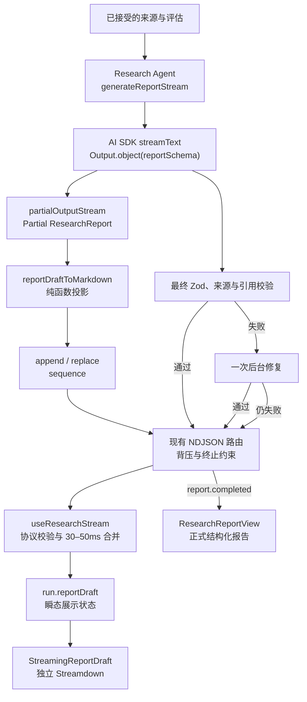
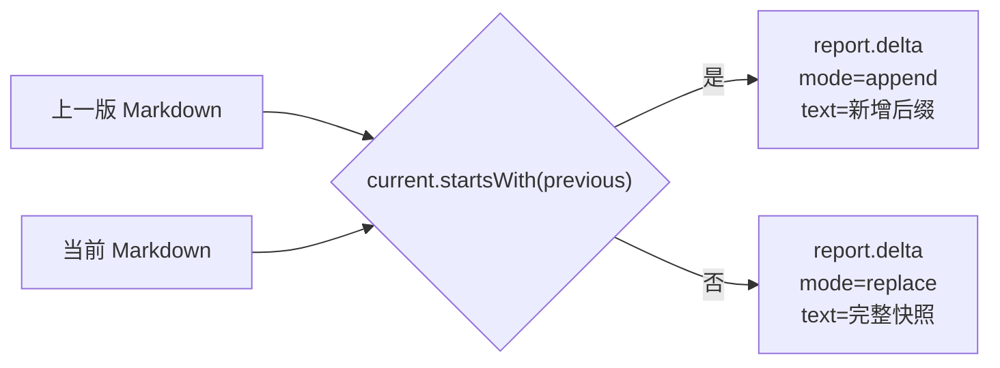
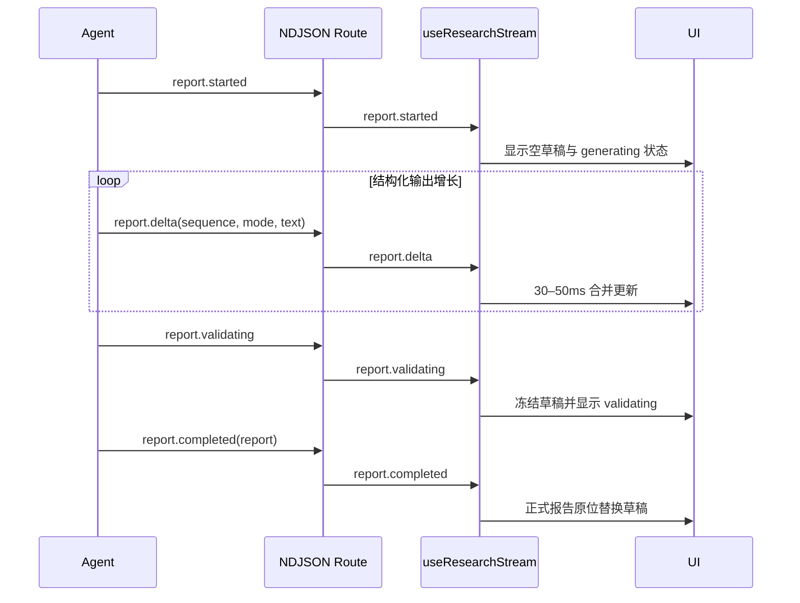
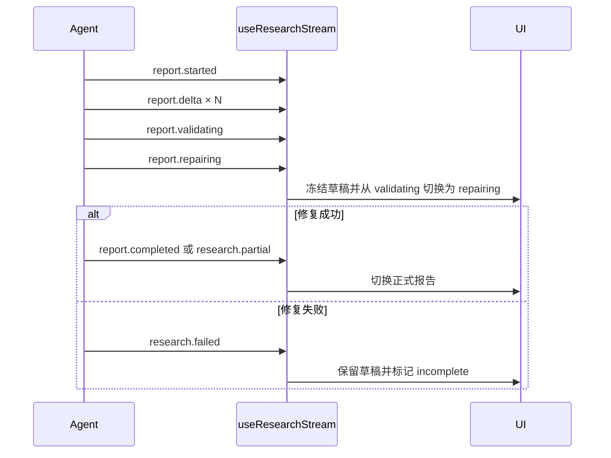

# 最终研究报告真实流式输出设计

## 1. 背景与目标

当前研究流程已经通过 NDJSON 持续发送 Plan、Search、Source、Gap、Conclusion 和终止事件，但最终报告不是文本增量流。Agent 先发送 `report.started`，随后等待 `generateText + Output.json()` 返回完整 `ResearchReport`，最后一次性发送 `report.completed` 或 `research.partial`。浏览器收到完整报告后，仅用 CSS 让标题和区块延迟显现。

这种实现能保证结构化校验和引用安全，却没有 DeepSeek、Kimi、Gemini 等主流 AI 产品中“正文随着模型真实生成而持续增长”的体验。用户已经确认将最终报告改为真实增量输出，同时保留现有结构化研究工作台、Printer、来源抽屉和严格报告校验。

成功标准：

- 最终报告生成期间，用户能看到由真实模型增量驱动的连续 Markdown 草稿；
- 正常生成只调用一次模型，草稿与正式报告来自同一次结构化生成；
- 最终结果继续通过 `reportSchema`、来源 ID 和引用约束校验；
- 草稿失败或取消后仍保留，明确标记为未完成，并允许从头重试；
- 自动修复期间不清空或重新播放第一次草稿；
- 不引入 assistant-ui Runtime，不把研究工作台改造成聊天线程；
- 继续维持桌面左右双滚动、右侧单一滚动所有者和手机端整页滚动；
- 代码中的非显然协议、合并和滚动约束提供有学习价值的中文注释。

## 2. 已确认的产品与技术决策

- 生成期间采用“连续 Markdown 草稿”，完成后切换为当前结构化报告视图。
- 采用 AI SDK 6 的 `streamText + Output.object({ schema: reportSchema })` 和 `partialOutputStream`。
- 连续 Markdown 由 partial `ResearchReport` 通过纯函数实时转换，而不是让模型直接输出任意 Markdown。
- 正常路径只调用一次模型；不采用“先生成 Markdown、再调用一次模型结构化”的双调用方案。
- 第一次最终校验失败时自动后台修复一次；修复期间冻结并保留第一次草稿。
- 修复成功后切换正式报告；修复仍失败则保留草稿并标记未完成。
- 网络中断、协议错误或用户取消都保留已有草稿。
- 网络增量在客户端每 30～50ms 合并为一次 React 更新，不实现固定字符速度的人工打字队列。
- 只新增独立 `streamdown`，不引入 `@assistant-ui/react`、Thread Runtime、Message Runtime 或 assistant-ui 滚动视口。
- `Streamdown` 只负责生成中草稿的 Markdown 渲染，不接管业务状态、事件协议或滚动。
- 草稿开始时右侧定位到报告顶部；正式报告完成替换草稿时保持当前阅读位置，不再强制回到顶部。
- 流式草稿中的链接和图片不可交互；正式报告仍只允许已收集来源的安全 URL。

## 3. 未采用方案

### 3.1 原始 Markdown 流加第二次结构化

先使用 `streamText` 输出 Markdown，再调用一次模型生成 `ResearchReport`。该方案容易获得自然文本流，但会增加调用成本、延长完成时间，并可能让草稿和正式报告表达不一致。

### 3.2 按报告区块分别调用模型

标题、摘要、Findings、Trends、Disagreements 和 Limitations 分别生成。该方案结构明显，但调用次数多，区块间重复、矛盾和引用漂移风险最高。

### 3.3 完整引入 assistant-ui

assistant-ui 适合聊天线程、消息、Composer、分支、编辑和重新生成等场景。当前产品是由自定义 ResearchEvent 驱动的研究工作台，已经拥有状态、滚动、Printer 和来源交互。为一块报告草稿引入 Thread Runtime 会造成重复状态和滚动所有权冲突，因此本次只使用独立的流式 Markdown 渲染器。

## 4. 总体架构



正常模型调用同时提供两种视图：

1. `partialOutputStream` 驱动生成中的 Markdown 草稿；
2. 最终 `output` 作为严格校验后的 `ResearchReport`。

草稿不是第二份业务状态，也不能产生新的研究结论。它只是同一次结构化生成的瞬态展示投影。

## 5. 服务端生成与草稿投影

### 5.1 流式模型接口

`ResearchModel` 为报告增加流式能力，返回一个可由 Agent 消费的接口，而不是把 AI SDK Result 直接泄漏到业务层。接口需要表达：

- partial report 更新；
- 最终结构化结果；
- 取消信号；
- 模型调用计数；
- 最终校验失败。

普通 Plan、Search、Evaluate 和 Evidence Assessment 继续使用现有非流式结构化调用，本次只改最终报告阶段。

### 5.2 partial report 转 Markdown

新增无副作用的 `reportDraftToMarkdown(partialReport, citationNumbers)`：

- 按固定顺序输出标题、Executive Summary、Key Findings、Trends、Disagreements 和 Limitations；
- 字段缺失或数组元素尚未生成时安全跳过；
- 字符串增长时只扩展当前区块；
- Findings 仅在已有 claim 时出现；
- 草稿引用显示为不可点击的文本编号，不生成 URL；
- 不补造缺失字段、不推断来源、不修正文案；
- 相同输入始终得到相同 Markdown，便于重放和测试。

服务端保留上一版 Markdown：



`append` 避免每次重复传输整篇草稿；如果 SDK 的 partial object 修正了前文，则用 `replace` 恢复客户端一致性。这里必须加入中文注释解释：partial structured output 通常增长，但协议不能把“通常”当成不变量。

### 5.3 最终校验与后台修复

第一次流结束后读取最终 `output`，执行：

1. `reportSchema` 校验；
2. 已收集来源 ID 校验；
3. 被引用来源必须已接受的业务校验；
4. 现有报告引用完整性校验。

若通过，发送 `report.completed` 或 `research.partial`。若失败：

- 发送一次 `report.repairing`；
- 不发送第二组草稿 delta；
- 保留第一次草稿作为可阅读内容；
- 使用现有完整结构化生成方式后台修复一次；
- 修复成功后发送正式报告；
- 修复失败后发送安全的 `research.failed`，不得公开原始 provider 输出或校验细节。

## 6. 事件协议

### 6.1 事件顺序

正常路径：



需要后台修复的路径：



### 6.2 `report.delta`

事件公开字段：

```ts
{
  type: "report.delta";
  sequence: number;
  mode: "append" | "replace";
  text: string;
}
```

约束：

- `sequence` 从 0 开始并严格递增；
- `append` 的 `text` 是新增后缀；
- `replace` 的 `text` 是当前完整草稿；
- 空更新不发送；
- 单条事件继续受 `MAX_ENCODED_EVENT_BYTES` 限制；
- 事件只能包含公开 Markdown，不得包含原始 JSON、私有推理或 provider 错误；
- 重复、跳号、倒序或非法 mode 视为协议错误。

### 6.3 `report.validating` 与 `report.repairing`

两者都是低频、可重放的研究流程事件并进入 `run.events`：partial stream 结束后先发送 `report.validating`；只有最终对象校验失败且可修复时才继续发送 `report.repairing`。Printer 将当前 Synthesis 记录依次更新为 `validating` 或 `repairing`，而不是新增大量草稿卡片。两个事件都不包含错误细节。

### 6.4 高频事件不进入持久展示日志

`report.delta` 经过 schema 校验后只更新 `run.reportDraft`，不追加到 `run.events`。原因：

- 避免几百条文本增量污染 Printer；
- 避免 `derivePrinterRecords` 和 `deriveResearchViewModel` 每次重放完整 delta 历史；
- 避免事件数量驱动不必要的滚动副作用；
- 保持 `run.events` 作为有限、可理解的研究过程日志。

这是一条例外边界：服务端协议仍传输 delta，但客户端只把研究事实与阶段事件保存在 `run.events`。

## 7. 客户端状态与合并

`ResearchRun` 增加瞬态草稿：

```ts
interface ReportDraftState {
  markdown: string;
  sequence: number;
  status: "streaming" | "validating" | "repairing" | "incomplete";
}
```

Hook 接收每个合法 delta 后先在 ref 中顺序应用，保证协议状态不受 React 批处理影响；React 可见状态最多每 30～50ms提交一次。实现必须满足：

- 新 delta 到达时取消并复用已有调度器，不为每个 token 建立独立定时器；
- 完成、失败、取消、retry、reset 和 unmount 时清理未提交任务；
- 终止前强制 flush 最新合法草稿，避免最后一段文本丢失；
- `replace` 覆盖 ref 中的完整 Markdown；
- sequence 非法时停止消费当前 generation，并进入统一协议失败；
- generation 变化后迟到的 delta 不得污染新研究；
- retry 和 new research 清空旧草稿；
- failed / cancelled 保留草稿并改为 `incomplete`；
- completed / partial 清理瞬态草稿并展示正式报告。

30～50ms 是渲染合并窗口，不是人工字符速度。网络真实增量不会被改写成固定速度队列，也不会在模型已经完成后继续“假装生成”。

## 8. UI 与滚动行为

### 8.1 草稿视图

新增 `StreamingReportDraft`：

- 使用独立 `streamdown` 包；
- `streaming` 时显示流式 caret；
- `validating` / `repairing` 时冻结正文并显示状态提示；
- `incomplete` 时显示明确的未完成提示和现有 Retry 入口；
- 自身不创建纵向滚动容器；
- 不拥有跟随状态；
- 不执行来源打开操作；
- 不把正文设为 `aria-live`。

`ResearchWorkbench` 继续拥有 `.workspace-content`、滚动 ref、底部阈值、ResizeObserver 和“回到最新”按钮。

### 8.2 页面阶段

1. `report.started`：草稿成为右侧主内容，右侧只在这次转换时定位到草稿顶部；Printer 折叠到下方流程归档。
2. `streaming`：草稿持续增长；位于底部附近时自动跟随，用户向上阅读后暂停。
3. `validating` / `repairing`：停止 caret，草稿保持稳定，滚动位置不变。
4. `completed` / `partial`：正式 `ResearchReportView` 原位替换草稿，保持用户阅读位置。
5. `failed` / `cancelled`：草稿继续作为主内容并标记未完成，终止记录保留在下方 Printer。

“回到最新进度”在报告草稿期间改为“Back to latest report”，行为仍由右侧工作区统一控制。

### 8.3 完成时不再跳顶

此前滚动规格要求 `report.completed` 首次出现时跳到报告顶部，因为此前报告只能完整到达。本设计把跳顶时机提前到 `report.started` 草稿成为主内容时。用户随后可能已经阅读、跟随或主动暂停，因此完成替换时不得再次强制跳顶。

该决策覆盖：

- `2026-07-15-scroll-boundary-simplification-design.md` 中“完成态首次出现时跳到顶部”的旧时机；
- `ResearchWorkbench` 现有基于 `reportFirst` 的完成态回顶逻辑。

滚动所有权本身不变：桌面仍只有左侧进度和右侧工作区两个常驻纵向滚动容器，手机端仍由页面滚动。

### 8.4 避免重复动画

当前正式报告具有 `report-feed` 区块显现动画。若已经展示过真实流式草稿，正式报告替换时不再重新播放整套出纸动画，避免用户看到同一内容生成两次。只有没有任何草稿 delta 的兼容或降级路径可以保留现有区块显现动画。

## 9. Markdown 与来源安全

- `Streamdown` 使用 streaming mode 处理未闭合 Markdown；
- 草稿禁用图片；
- 草稿链接统一渲染为不可点击文本，不信任模型生成 href；
- partial report 转换器只根据已接受来源映射显示纯文本引用编号；
- 正式报告继续复用 `ResearchReportView` 的 URL canonicalization 和来源 allowlist；
- 不启用原始 HTML；
- provider 响应体、异常 message、私有字段和原始结构化 JSON 不进入草稿；
- delta 仍通过现有严格 schema 与编码字节上限。

## 10. 异常、取消与恢复

| 场景 | 草稿 | 研究事件 | 用户操作 |
| --- | --- | --- | --- |
| 网络或 reader 失败 | 保留并标记 incomplete | 唯一 `research.failed` | Retry / New research |
| 协议或 sequence 错误 | 保留最后合法版本 | 安全 `research.failed` | Retry / New research |
| 用户取消 | 保留并标记 incomplete | 唯一 `research.cancelled` | Retry / New research |
| partial stream 结束 | 冻结为 validating | `report.validating` | 等待最终对象校验 |
| 第一次最终校验失败 | 从 validating 变为 repairing | `report.repairing` | 等待后台修复 |
| 后台修复成功 | 由正式报告替换 | completed / partial | 正常阅读 |
| 后台修复失败 | 保留并标记 incomplete | 唯一 `research.failed` | Retry / New research |
| 完成前没有任何 delta | 显示生成状态 | 最终 completed / failed | 使用兼容路径 |

服务端终止事件仍保持唯一；客户端合成失败/取消事件的既有去重和 generation 隔离规则继续适用。

## 11. 性能与可访问性

- React 最快每 30～50ms提交一次草稿状态；
- Streamdown 负责流式 Markdown block reconciliation，不为每个字符建立 DOM 节点；
- Printer 和 ViewModel 不消费高频 delta 历史；
- 右侧只有 `.workspace-content` 负责纵向滚动；
- ResizeObserver 继续观察普通文档流高度，草稿增长也能正确更新跟随状态；
- 用户离开底部后不再被新 delta 拉走；
- `prefers-reduced-motion` 下关闭 caret、淡入和过渡动画，但文本仍实时更新；
- 草稿正文不使用 `aria-live`，避免屏幕阅读器朗读每个 token；
- 现有状态区域只播报“生成报告、校验、修复、完成、失败、取消”等阶段变化；
- 终止、retry、reset 和 unmount 必须清理 timer、reader 与 abort controller。

## 12. 文件职责

| 文件 | 职责 |
| --- | --- |
| `package.json` / lockfile | 新增独立 `streamdown`，不新增 assistant-ui Runtime |
| `lib/providers/research-model.ts` | 提供报告结构化流、最终 output 和一次后台修复 |
| `lib/providers/research-model.test.ts` | 覆盖 partial stream、最终校验、取消、修复与安全错误 |
| `lib/agent/report-draft.ts` | partial report 到 Markdown、append/replace 差异计算纯函数 |
| `lib/agent/report-draft.test.ts` | 覆盖缺失字段、增长、数组、引用、回退 replace 和确定性 |
| `lib/agent/research-events.ts` | 定义 `report.delta`、`report.validating`、`report.repairing` 与大小/sequence 约束 |
| `lib/agent/research-events.test.ts` | 覆盖新事件的严格解析、私有字段拒绝和编码上限 |
| `lib/agent/research-state.ts` | 接受 validating / repairing 阶段事件并保持合法状态机转换 |
| `lib/agent/research-agent.ts` | 编排 started、delta、validating、repairing、completed/partial/failed |
| `lib/server/research-route.ts` | 延续 NDJSON 背压、取消和唯一终止保证 |
| `components/research/use-research-stream.ts` | 校验 delta、独立草稿状态、30–50ms 合并、generation 隔离 |
| `components/research/streaming-report-draft.tsx` | 使用 Streamdown 渲染草稿与阶段提示，不拥有滚动 |
| `components/research/research-printer-model.ts` | 忽略 delta；将 validating / repairing 投影到当前 Synthesis 记录 |
| `components/research/research-workbench.tsx` | 草稿/正式报告切换、滚动跟随、完成保持位置 |
| `components/research/research-report.tsx` | 保留正式报告和安全来源引用；支持流式完成后禁用重复入场动画 |
| `app/globals.css` | 草稿状态、caret、validating/repairing/incomplete、reduced-motion 样式 |
| `docs/architecture.md` | 解释真实报告流、瞬态草稿与正式报告边界及学习路径 |

拆分原则：协议、投影、流消费、展示和滚动各自只有一个所有者。`report-draft.ts` 必须保持纯函数，`StreamingReportDraft` 必须保持无滚动状态，`ResearchWorkbench` 必须继续是唯一右侧滚动控制者。

## 13. 测试策略

### 13.1 单元与协议测试

- partial 字符串增长生成 append；
- 新字段和新数组项以固定 Markdown 顺序出现；
- partial 前文变化触发 replace；
- 缺失字段不生成伪占位结论；
- 草稿引用只输出不可点击编号；
- delta sequence、mode、空文本、额外字段和字节上限；
- validating / repairing 合法状态转换与重复终止拒绝。

### 13.2 Provider 与 Agent 测试

- 使用可控 partial stream 验证真实结构化增量；
- 最终 output 通过 schema 与引用校验；
- 第一次失败只触发一次后台修复；
- 修复期间不发送第二组 delta；
- abort 及时停止生成；
- provider 原始异常和响应内容不进入公开事件；
- 正常顺序为 started → delta × N → validating → completed/partial；
- 修复顺序为 started → delta × N → validating → repairing → completed/partial 或 failed。

### 13.3 Hook 与组件测试

- 高频 delta 在 fake timers 下合并为 30～50ms React 更新；
- append、replace 和 sequence 正确；
- 终止前 flush 最后一段；
- failed / cancelled 保留草稿；
- retry / reset / generation 变化清空并隔离迟到 delta；
- Streamdown streaming、repairing、incomplete 和 reduced-motion 状态；
- 草稿链接与图片不可交互；
- 草稿开始时一次回顶；
- 位于底部时跟随增长；
- 用户向上阅读后停止跟随；
- 完成替换保持位置且不重复 report-feed；
- 手机端继续由 document 滚动。

### 13.4 浏览器验收

使用真实 provider 和足够长的研究问题验证：

1. `report.started` 后草稿区域立即出现；
2. 草稿文本在模型仍运行时多次增长，而不是完成后统一播放；
3. 更新节奏连续，无明显 token 级抖动或整页重排；
4. 上滚后新 delta 不抢位置，恢复按钮回到最新草稿；
5. 完成切换正式报告时不跳顶、不产生新的内部滚动容器；
6. 主动取消后草稿保留并显示 incomplete；
7. retry 清空旧草稿并从新 generation 开始；
8. 来源抽屉、桌面左右滚动和移动端整页滚动无回归；
9. Console 不出现应用自身 hydration、key、更新循环或 Streamdown 安全警告。

完整验证命令：

```bash
npm test
npm run lint
npm run typecheck
npm run build
git diff --check
```

## 14. 学习与注释要求

以下非显然位置必须提供有价值的中文注释：

- 为什么 partial object 需要 append/replace 双模式；
- 为什么高频 delta 不进入 `run.events`；
- 为什么 sequence 必须在 React 合并前验证；
- 为什么终止前必须 flush 草稿；
- 为什么后台修复不能重播第二组草稿；
- 为什么完成态不再跳顶；
- 为什么流式正文不能使用 `aria-live`；
- 为什么草稿链接必须不可交互。

`docs/architecture.md` 增加推荐阅读顺序：事件 schema → 模型结构化流 → 草稿投影 → NDJSON 路由 → Hook 合并 → Streamdown 草稿 → Workbench 滚动 → 正式报告安全引用。

## 15. 与既有设计的关系

本文档扩展并局部覆盖：

- `2026-07-15-structured-research-printer-design.md`：保留结构化 Printer、来源抽屉和完成态报告优先展示，但加入生成中草稿主视图；
- `2026-07-15-scroll-boundary-simplification-design.md`：保留滚动所有权，只把首次回顶时机从 completed/partial 提前到 `report.started`；
- 现有“服务端 Agent 和协议不变”约束被本功能明确替换，因为真实报告流必须新增报告增量事件。

未被本文明确覆盖的既有行为继续有效。
